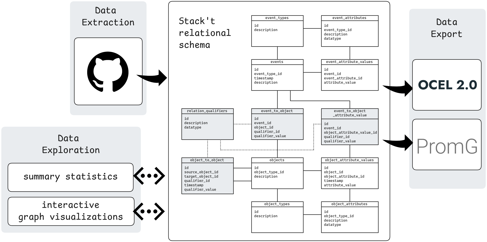

# PyStack't design

PyStack't has a modular design, enabled by the use of a fixed relational schema to store OCED data. Since the tables and columns are always the same, independent of object and event types, it's easy to plug in new data sources and other functionality. Any new functionality is automatically compatible with existing code, which is a big win for maintainability.

## Data Storage

PyStack't uses the Stack't relational schema to store object-centric event data. This schema was created specifically to support the data preparation stage, taking into account data engineering best practices.
While any relational database can be used to store data in the Stack't relational schema, PyStack't uses [DuckDB](https://duckdb.org/) because it's open-source, fast and simple to use. (Think SQLite but for analytical workloads.)

### Stack't relational schema

The Stack't relational schema describes how to store object-centric event data in a relational database using a fixed set of tables and table columns. This absence of any schema changes makes the format well-suited to act as a central data hub, enabling the modular design of PyStack't.

An overview of the tables and columns is included below. For more information on the design choices and the proof-of-concept implementation [Stack't](https://github.com/LienBosmans/stack-t), we recommend reading the paper [Dynamic and Scalable Data Preparation for Object-Centric Process Mining](https://arxiv.org/abs/2410.00596).

**Event-related tables**. To maintain flexibility and support dynamic changes, event types and their attribute definitions are stored in rows rather than being defined by table and column names. This approach enables the use of the exact same tables across all processes, reducing the impact of schema modifications. Changing an event type involves updating foreign keys rather than moving data to different tables, and attributes can be added or removed without altering the schema.
- Table `event_types` contains an entry for each unique event type. \
    Columns: 
    -   `id` is the primary key.
    -   `description` should be human-readable.
-   Table `event_attributes` stores entries for each unique event attribute. \
    Columns:
    -   `id` is the primary key.
    -   `event_type_id` is a foreign key referencing table `event_types`.
    -   `description` should be human-readable.
    -   `datatype` of the attribute (integer, varchar, timestamp, ...) of the attribute.
-   Table `events` records details for each event. \
    Columns:
    -   `id` is the primary key.
    -   `event_type_id` is a foreign key referencing table `event_types`.
    -   `timestamp`, preferably using UTC time zone.
    -   `description` should be human-readable.
-   Table `event_attribute_values` stores all attribute values for different events. This setup decouples events and their attributes by storing each attribute value in a new row, facilitating support for late-arriving data points. \
    Columns:
    -   `id` is the primary key.
    -   `event_id` is a foreign key referencing table `events`.
    -   `event_attribute_id` is a foreign key referencing table `event_attributes`.
    -   `attribute_value` is the value of the attribute. This value should match the datatype of the attribute.

**Object-related tables** also leverage row-based storage to manage attributes independently. This approach reduces the number of duplicate or NULL values significantly when attributes are updated asynchronously and frequently.
-   Table `object_types` records entries for each unique object type.\
    Columns:
    -   `id` is the primary key.
    -   `description` should be human-readable
-   Table `object_attributes` contains entries for each unique object attribute. \
    Columns:
    -   `id` is the primary key.
    -   `object_type_id` is a foreign key referencing table `object_types`.
    -   `description` should be human-readable.
    -   `datatype` (integer, varchar, timestamp, ...) of the attribute.
-   Table `object` stores details for each object.\
    Columns:
    -   `id` is the primary key.
    -   `object_type_id` is a foreign key referencing table `object_types`.
    -   `description` should be human-readable.
-   Table `object_attribute_values` records attribute values for objects.\
    Columns: 
    -   `id` is the primary key.
    -   `object_id` is a foreign key referencing table `objects`.
    -   `object_attribute_id` is a foreign key referencing table `object_attributes`.
    -   `timestamp` indicates when the attribute was updated. Timestamps are preferably stored using the UTC time zone.
    -   `attribute_value` is the updated value of the attribute. This value should match the datatype of the attribute.

**Relation-related tables** serve as bridging tables to manage the different many-to-many relations between events and objects. The qualifier definitions are stored separately to minimize the impact of renaming them in case of changing business requirements 
-   Table `relation_qualifiers` stores qualifier definitions. In cases where relation qualifiers are not available in the source data, a dummy qualifier can be introduced.\
    Columns
    -   `id` is the primary key.
    -   `description` should be human-readable.
    -   `datatype` (integer, varchar, timestamp, ...) of the attribute.
-   Table `object_to_object` stores (dynamic) relations between objects.\
    Columns:
    -   `id` is the primary key.
    -   `source_object_id` is a foreign key referencing table `objects`.
    -   `target_object_id` is a foreign key referencing table `objects`.
    -   `timestamp` indicates when the relationship became active. To signify the end of an object-to-object relationship, a NULL value is used for the qualifier value, rather than an end timestamp. This design choice facilitates append-only data ingestion. Timestamps are preferably stored using the UTC time zone.
    -   `qualifier_id` is a foreign key referencing table `qualifiers`.
    -   `qualifier_value` provides additional relationship details. This value should match the datatype of the qualifier.
-   Table `event_to_object` stores relations between events and objects.\
    Columns:
    -   `id` is the primary key.
    -   `event_id` is a foreign key referencing table `events`.
    -   `object_id` is a foreign key referencing table `objects`.
    -   `qualifier_id` is a foreign key referencing table `qualifiers`.
    -   `qualifier_value` provides additional relationship details. This value should match the datatype of the qualifier.
-   Table `event_to_object_attribute_value` stores relations between events and changes to object attributes.\
    Columns:
    -   `id` is the primary key.
    -   `event_id` is a foreign key referencing table `events`.
    -   `object_attribute_value_id` is a foreign key referencing table `object_attribute_values`.
    -   `qualifier_id` is a foreign key referencing table `qualifiers`.
    -   `qualifier_value` provides additional relationship details. This value should match the datatype of the qualifier.

## Data extraction

Extracting data from different systems is an important part of data preparation. While PyStack't does not include all functionality that a data stack offers (incremental ingests, scheduling refreshes, monitoring data pipelines...), it aims to provide simple-to-use methods to get real-life data for your object-centric process mining adventures.

## Data export

The Stack't relational schema is intended as an intermediate storage hub. PyStack't provides export functionality to export the data to specific OCED formats that can be used by process mining applications and algorithms. This decoupled set-up has as main advantage that any future data source can be exported to all supported data formats, and any future OCED format can be combined with existing data extraction functionality.

## Data exploration

Dispersing process data across multiple tables makes exploring object-centric event data less straightforward compared to traditional process mining. PyStack't aims to bridge this gap by providing dedicated data exploration functionality. Notably, it includes an interactive data exploration app that runs locally and works out-of-the-box with any OCED data structured in the Stack't relational schema.
