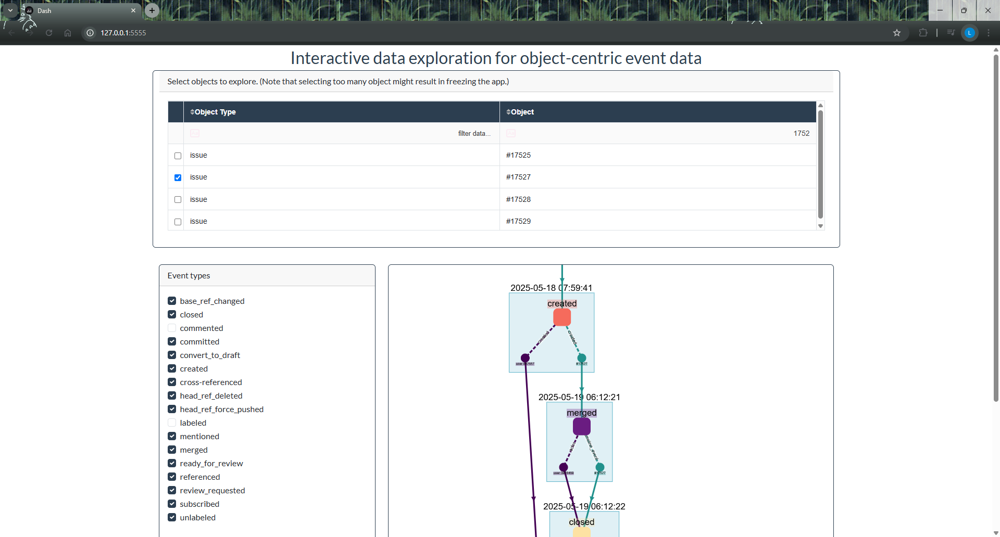

# 📈 PyStack't Interactive Data Exploration for Object-Centric Event Data

## 📝 Example

```python
from pystackt import *

prepare_graph_data(
    quack_db="./stackt.duckdb",
    schema_in="main",
    schema_out="graph_data_prep"
)

start_visualization_app(
    quack_db="./stackt.duckdb",
    schema="graph_data_prep"
)
```

### ⚙️ Step 1: `prepare_graph_data()`
Transforms the OCED data into a structure that is optimized for interactive graph visualization. You only need to this once for each dataset.

| Parameter     | Type   | Description                                                  |
|---------------|--------|--------------------------------------------------------------|
| `quack_db`    | `str`  | Path to the DuckDB database file containing the input data.  |
| `schema_in`   | `str`  | Name of the schema in the DuckDB file that contains the input data. Needs to be stored using in Stack't relational schema. |
| `schema_out`  | `str`  | Name of the schema where the table `graph_base_table`, used by the interactive exploration app,  will be created. If the schema already exists, it will be cleared first. |

#### Input data (`quack_db`, `schema_in`)
The input data for this function needs to be stored in a DuckDB database file using the Stack't relational schema. The path to the DuckDB file is defined in `quack_db`. The schema in which the data is stored is defined by `schema_in`.

#### Output table (`schema_out`)
A table named `graph_base_table` will be created in the schema `schema_out`. If the schema already exists, it will be cleared first.


### ▶️ Step 2: `start_visualization_app()`
Launches a local interactive app in your default browser to explore your OCED data.

| Parameter     | Type   | Description                                                  |
|---------------|--------|--------------------------------------------------------------|
| `quack_db`    | `str`  | Path to the DuckDB database file containing the input data.  |
| `schema`      | `str`  | Name of the schema in the DuckDB file that contains the table `graph_base_table`. Needs to be created first by the function `prepare_graph_data`. |
| `host`        | `str`  | *(Optional)* Host address to serve the visualization app. Defaults to "127.0.0.1". |
| `port`        | `int`  | *(Optional)* Port number for the app. Default to "5555". Use different ports to run multiple instances simultaneously.  |

#### Input data (`quack_db`, `schema`)
This function uses as input data the `graph_base_table` created by the previous function. Make sure you point to the correct DuckDB database file and schema.

#### Optional arguments (`host`, `port`)
`host` and `port` determine where you can access the visualization app. If you want to run multiple instances of the visualization app at once, you need to use different ports to avoid interference.

## App components



### Table to filter on objects

Since the goal is exploration, there is no process map. 
- Simply select an object to explore their events, by using the checkboxes.
- Sort the table by clicking on the arrow icons next to the column header.
- Filter the table by using the filter box below the column header. Press ENTER for the filter to be applied.

Selecting an object adds all events that are linked to that object to the graph visualization. For any event that is shown, all objects linked to that event are shown as well as 'object snapshot' nodes.

It's possible to select multiple objects at once. In theory there is no limit on the number of objects, although you will run into performance issues if you select too many objects at once. If you're app freezes as a results, just quit by pressing CTRL+C and try again with less objects.


### Filter on event types and object types

By default, all event types and object types are included. Deselecting event types and object types has the same effect on the visualization as not including them in the dataset at all.


### Graph visualization

As soon as an object is selected, the graph visualization is generated. 
Interaction with the graph is possible by zooming, panning, and dragging nodes to explore the graph layout dynamically.
The graph is regenerated every time a checkbox is (de)selected.

- events: 
    - rectangular nodes
    - colors are automatically assigned based on event type using color palette 'magma'
    - labeled with event type
- object snapshots
    - small circular nodes
    - colors are automatically assigned based on object type using color palette 'viridis'
    - labeled with object description
- timestamp parent nodes
    - light-blue rectangles
    - labeled with timestamp
    - hold all event nodes and object snapshots that share a timestamp
- event-to-object relations:
    - solid edges
    - colors are automatically assigned based on object type using color palette 'viridis'
    - labeled with relation qualifier
- directly-follows
    - dashed edges
    - colors are automatically assigned based on object type using color palette 'viridis'
    - connects each object snapshot to the next event of that object
    - multiple outgoing edges are possible in case of parallel events
